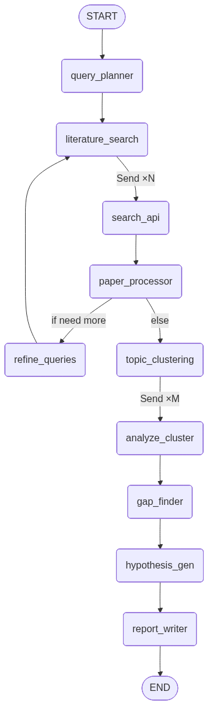

# Research Gap Finding Agent

A LangGraph-based agent that searches public literature APIs, analyzes the corpus, and outputs structured research gaps with suggested follow-up hypotheses for a given domain or question.

## Table of contents

- [Agent flow](#agent-flow)
- [Implementation decisions and reasoning](#implementation-decisions-and-reasoning)
- [Assumptions](#assumptions)
- [Future improvements](#future-improvements)
- [How to run](#how-to-run)

---

## Agent flow

The pipeline has three phases: **Search**, **Analysis**, and **Synthesis**. A single LangGraph state is updated as execution moves through nodes; parallel work uses reducers so multiple nodes can append to the same lists.

### High-level sequence

1. **Query planner**  
   Takes the user query and, via an LLM with structured output, produces 3–5 search query strings. The depth preset (`quick` / `standard` / `deep`) is set by the user (CLI `--depth`, default `standard`). Depth controls `min_papers`, `max_papers`, `max_search_iterations`, and cluster range (`min_clusters`–`max_clusters`). Relevance filtering uses a single `relevance_threshold` for all depths (set in `config.yaml`).

2. **Literature search (fan-out)**  
   A conditional edge emits one `Send("search_api", …)` per (API × query). Each **search_api** node runs one sync HTTP call to Semantic Scholar, OpenAlex, or arXiv for one query and appends normalized `Paper` objects to `search_results` (reducer: `operator.add`).

3. **Paper processor**  
   Deduplicates by DOI, then by fuzzy title similarity (threshold 0.9). Scores each paper’s relevance to the original query with a batch LLM call, then keeps papers above the configured relevance threshold up to `max_papers`.

4. **Coverage check**  
   If `len(filtered_papers) < min_papers` and `search_iteration < max_search_iterations`, the graph routes to **refine_queries** (increments `search_iteration`) and loops back to the literature search fan-out with the same refined queries. Otherwise it proceeds to topic clustering.

5. **Topic clustering**  
   An LLM groups the filtered papers into a number of thematic clusters (within the preset’s `min_clusters`–`max_clusters` range; label, description, `paper_indices`). Structured output is used where possible.

6. **Deep analysis**  
   A conditional edge emits one `Send("analyze_cluster", …)` per cluster. Each **analyze_cluster** node receives one cluster’s papers (numbered 1..K) and produces a `ClusterAnalysis` with structured **findings**: each finding has text and supporting paper indices (1-based into `filtered_papers`). Methodologies, limitations, trend, and contradictions are also produced. Results are appended to `cluster_analyses` via the same reducer pattern.

7. **Gap finder**  
   Consumes all cluster analyses, the original query, and a **canonical citation list** (numbered 1..N from `filtered_papers`). The LLM may only cite papers from this list. It returns research gaps with types (topic, methodological, scope, temporal, contradiction, integration) and **supporting_paper_indices** (1-based indices into the same list). Indices are validated and clamped to 1..N so no invented papers enter the pipeline.

8. **Hypothesis generator**  
   For each gap, the LLM suggests 1–2 hypotheses (title, description, suggested methodology). Output is structured (e.g. `HypothesisList`). Hypotheses are linked to gaps by title; citations flow from gap to supporting papers. **Hypothesis generation uses a higher temperature** (default 0.5, configurable in `config.yaml` under `llm.hypothesis_temperature`) than the rest of the pipeline to encourage more creative, diverse suggestions.

9. **Report writer**  
   Receives the full citation list, **findings with supporting citation keys** (from `cluster_analyses`: each finding lists which papers [1], [2], … support it), and per-gap supporting citations. A single LLM call produces the report body with instructions to cite only as [1], [2], … up to N and to use the finding-level citations when describing evidence. **Section 5 (Key References)** is not generated by the LLM: it is built programmatically from `filtered_papers` and injected (or replaces any LLM-written section 5). Any [n] in the report with n outside 1..N is stripped so the final output contains only traceable, non-hallucinated references.

### Flow diagram



### Citations and references flow

Citations use `filtered_papers`: `[k]` = k-th paper (1-based). **gap_finder** outputs `supporting_paper_indices` in 1..N (validated); **report_writer** gets the list plus findings with citation keys and per-gap hints, cites only [1]..[N]. Section 5 (Key References) is built from `filtered_papers`; a post-pass strips invalid [n]. All references trace to the corpus.

---

## Implementation decisions and reasoning

| Area | Decision |
|------|----------|
| **LangGraph + single state** | One `AgentState` TypedDict with `Annotated[list, operator.add]` for `search_results` and `cluster_analyses` lets parallel nodes append without overwriting. The graph stays acyclic except for the explicit coverage loop. |
| **Sync HTTP in graph nodes** | The graph is invoked synchronously from the CLI. Literature API clients use sync entry points (`search_sync`, `_request_sync`) only. |
| **Three literature APIs** | Semantic Scholar, OpenAlex, and arXiv are free and cover different indexes. Each client normalizes to a shared `Paper` model so downstream nodes are API-agnostic. Failures in one API return `[]` so others still contribute. |
| **Deduplication** | DOI first, then normalized title + `SequenceMatcher` ratio ≥ 0.9. Logic lives in `utils/dedup.py`. |
| **Relevance scoring** | Papers are scored in batches (e.g. 20) with one LLM call per batch to stay within context and token limits. |
| **Depth presets** | `quick` / `standard` / `deep` map to paper limits, search iterations, and cluster range (`min_clusters`–`max_clusters`). One global `relevance_threshold` in `config.yaml` applies to all depths for filtering. |
| **Structured LLM output** | Query plan, clustering, gap list, and hypothesis list use Pydantic models and `with_structured_output()` to avoid brittle parsing. |
| **Hypothesis temperature** | Hypothesis generation runs with a higher LLM temperature (default 0.5) than the default pipeline temperature (0.2) to produce more creative, varied hypotheses; tunable via `config.yaml` → `llm.hypothesis_temperature`. |
| **Optional API keys** | Semantic Scholar and OpenAlex allow higher rate limits with keys; keys are optional. |
| **No human-in-the-loop** | The design allows optional interrupts (e.g. after query plan or paper list); the current CLI does not implement them. See [Future improvements](#future-improvements). |
| **Citations (single source of truth)** | All citations derive from `filtered_papers` only. Gap finder gets the numbered list and must output 1-based indices; we validate and discard out-of-range indices. Report writer receives this list, findings with citation keys, and per-gap hints; Section 5 is generated programmatically and a post-pass strips invalid [n]. No LLM discretion to invent papers. |

---

## Assumptions

- **Python 3.13+** and **uv** (or pip) for install/run.
- **At least one LLM provider** (OpenAI or Anthropic) is configured via env; the chosen `--provider` must have a valid API key.
- **Literature APIs** are public, best-effort; no SLA. OpenAlex may require a free API key for sustained use.
- **Input**: A short domain or question (e.g. a sentence or a few keywords). Very long or multi-document inputs are not optimized for.
- **Output**: Gaps and hypotheses are LLM-generated suggestions, not verified against ground truth. Citations in the report are restricted to the analyzed corpus (`filtered_papers`).
- **Environment** has network access to the LLM provider and to Semantic Scholar, OpenAlex, and arXiv.

---

## Future improvements

- **Async implementations**: Add async literature API clients and invoke the graph with `astream`/`ainvoke` for parallel HTTP calls and faster search.
- **Checkpointing / run state memory**: Persist graph state (e.g. with LangGraph's `MemorySaver` or `SqliteSaver`) so runs can be resumed or inspected; optional `checkpoint_path` in config and `--checkpoint` CLI flag.
- **Human-in-the-loop**: Use LangGraph `interrupt()` after query planning and/or paper filtering; allow editing queries or thresholds before continuing.
- **Caching**: Cache literature API responses (e.g. by query + API) with TTL for development or repeated runs.
- **PubMed (and others)**: Add another client and plug it into the same fan-out and `Paper` normalization.
- **Embedding-based clustering**: Optionally cluster by embeddings instead of or in addition to LLM-based clustering for speed and cost.
- **Streaming report**: Stream the final report token-by-token or section-by-section.
- **Multi-prompt report generation**: Instead of generating the full report in a single LLM call, split it into multiple prompts with distinct objectives (e.g. per-section or per-gap) to allow longer context and potentially more insightful, higher-quality sections that are later stitched together.
- **Stricter typing**: Replace remaining `list`/`dict` in state with concrete types (e.g. `list[ResearchGap]`) where it improves clarity.
- **Tests**: Unit tests for dedup, normalization, citation helpers, state reducers; integration tests with mocked LLM and API responses.
- **BibTeX / reference export**: Export the reference list as BibTeX or another standard format.
- **Per-node model configuration**: Allow configuring different LLMs for different nodes/tasks (e.g. a cheaper/faster model for query planning, a stronger one for gap finding and report writing) instead of using the same model for all nodes.
- **More agentic loops and agents**: Introduce additional specialized agents—e.g. a **paper relevancy checking agent** that refines or re-scores relevance in a dedicated subgraph, or a **hypothesis reviewer agent** that verifies whether suggested hypotheses are actually novel (against the analyzed corpus or external sources) before they appear in the final report—composed into the main flow.

---

## How to run

**Run behaviour is controlled by `config.yaml`** in the project root. Use it to set the LLM, literature APIs, depth presets (paper limits, cluster range), and relevance threshold. API keys and secrets go in `.env` only. Override the config file with `--config /path/to/config.yaml` or the `CONFIG_PATH` environment variable.

### Prerequisites

- Python 3.13+
- **uv** (recommended) or **pip**
- At least one LLM API key: OpenAI and/or Anthropic

### 1. Clone and enter the project

```bash
cd /path/to/research-gap-agent
```

### 2. Install dependencies

**With uv (recommended):**

```bash
uv sync
```

**With pip (in a venv):**

```bash
python -m venv .venv
source .venv/bin/activate   # Windows: .venv\Scripts\activate
pip install -e .
```

### 3. Configure environment and config

**Secrets (`.env`)**  
Copy the example env and set at least one LLM key:

```bash
cp .env.example .env
```

Edit `.env`:

| Key | When |
|-----|------|
| `OPENAI_API_KEY=sk-...` | Using `--provider openai` |
| `ANTHROPIC_API_KEY=sk-ant-...` | Using `--provider anthropic` |

Optional (better rate limits for literature APIs): `SEMANTIC_SCHOLAR_API_KEY`, `OPENALEX_API_KEY`. See OpenAlex docs for current policy.

**Run configuration (`config.yaml`)**  
The repository includes a `config.yaml` that defines how each run behaves. You should review and adjust it as needed:

| Section | What it controls |
|--------|-------------------|
| `llm` | Provider (openai/anthropic), model name, temperature, hypothesis temperature |
| `literature_apis` | Which backends to query: `semantic_scholar`, `openalex`, `arxiv` (at least one required) |
| `relevance_threshold` | Single threshold 0–1 for filtering papers by relevance; used for all depths |
| `depth_presets` | For each depth (`quick`, `standard`, `deep`): paper limits, search iterations, cluster range (`min_clusters`, `max_clusters`) |

All keys in `config.yaml` are required unless marked optional in the file. Use `--config path/to/other.yaml` (or `CONFIG_PATH`) to point the agent at a different config file.

### 4. Run the agent

From project root (no global install):

```bash
uv run python main.py "your research domain or question"
```

Or with the installed entrypoint:

```bash
uv run research-gap-agent "your research domain or question"
```

**Examples:**

```bash
uv run python main.py "machine learning in healthcare" --depth quick
uv run python main.py "transformer attention mechanisms" --depth standard
uv run python main.py "climate change and crop yields" --provider anthropic
uv run python main.py "single-cell RNA sequencing" --depth deep
```

**CLI options:**

| Option | Short | Description |
|--------|-------|-------------|
| `query` | — | Research domain or question (positional) |
| `--depth` | `-d` | `quick` \| `standard` \| `deep` (default: `standard`) |
| `--provider` | `-p` | `openai` \| `anthropic` (default: from `config.yaml`) |
| `--config` | `-c` | Path to config file (default: `config.yaml` or `CONFIG_PATH`) |
| `--no-json` | — | Do not write the JSON output file (default: JSON is written) |

**Depth presets (in `config.yaml`)**

Each depth preset defines paper limits (`min_papers`, `max_papers`), search iterations (`max_search_iterations`), and cluster range (`min_clusters`, `max_clusters`). Example defaults: **quick** (15–30 papers, 1 iteration, 2–4 clusters), **standard** (30–80 papers, 2 iterations, 3–7 clusters), **deep** (50–200 papers, 3 iterations, 5–10 clusters). The single **relevance_threshold** in `config.yaml` applies to all depths. Tune runs by editing `config.yaml` (see [Configure config.yaml](#3-configure-environment-and-config) above).

### 5. Output

Each run writes two files to `outputs/` by default:

- **Markdown report:** `outputs/<depth>_report_<query_slug>_<timestamp>.md` (e.g. `standard_report_long_term_memory_20260226_232453.md`).
- **Structured JSON:** `outputs/<depth>_report_<query_slug>_<timestamp>.json` — same base name with `.json` extension. The JSON contains `meta` (query, depth, timestamp, report_path), `report_markdown`, `papers`, `research_gaps`, `hypotheses`, `topic_clusters`, `cluster_analyses`, and `refined_queries`, so a frontend or UI can parse it without scraping markdown. Citation `[k]` in the report refers to the k-th item in `papers` (1-based).

Use `--no-json` to skip writing the JSON file. The CLI also prints a short summary of research gaps to the console.

---

## Project layout

```
research-gap-agent/
├── main.py
├── agent_graph.png
├── pyproject.toml
├── .env.example
├── src/research_gap_agent/
│   ├── __init__.py
│   ├── config.py
│   ├── llm.py
│   ├── cli.py
│   ├── models/
│   ├── tools/
│   ├── prompts/
│   ├── graph/
│   │   ├── builder.py
│   │   └── nodes/
│   └── utils/
└── README.md
```
